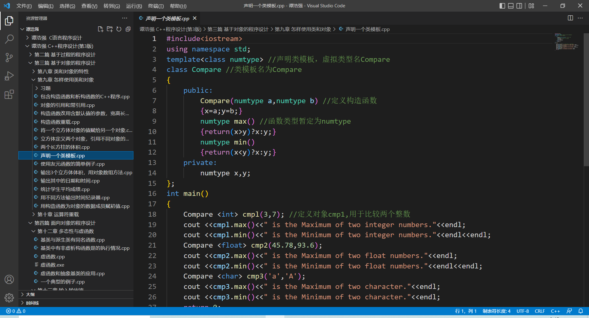
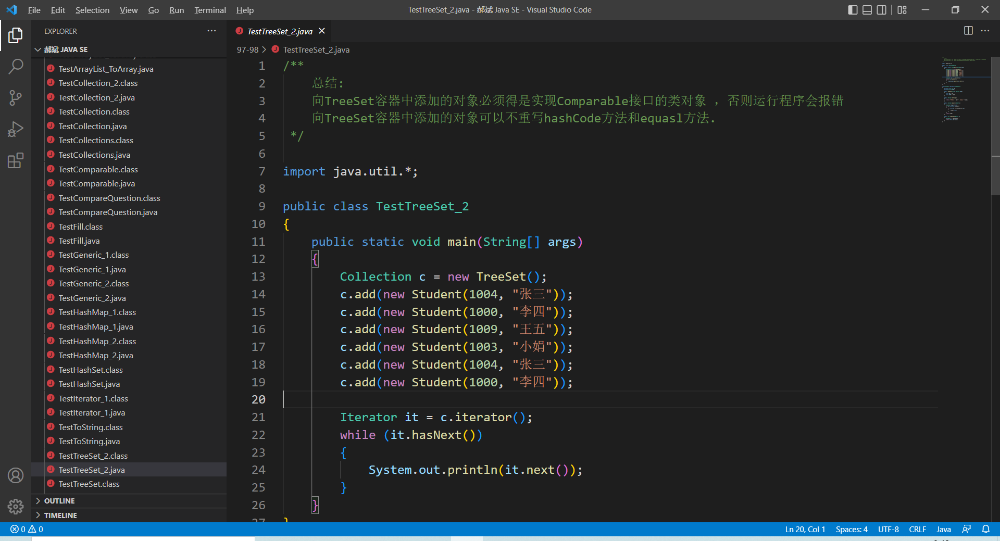

## 字符编码转换

1. 适合批量的文本编码转换工作。
2. 可以根据文件的命名特点来选择需要进行编码转换的文件。
   - 比如：文件是以某个后缀结尾
   - 可以通过与或非运算来 串并联 多个选择条件。
3.  存放转换后的文件的保存文件夹 不能包含在 需要编码的转换的文件夹路径中。
   - 比如：在 Windows 中，我们需要进行编码的文件在文件夹 **C:\tmp\修改** ，那么，保存编码后的文件夹不能位于 **C:\tmp\修改** 以及它的子文件夹。否则会导致文件的丢失。
4. 该程序应在 Windows 下运行，因为 Windows 是以反斜杠作为路径的分隔符，该程序也是基于这个情况下编写的。
   - 如果需要在 Linux 或者 Mac OS 下运行，请修改 Main.java 来解决路径的正则匹配问题。

### 步骤

1. 使用 Eclipse 新建一个项目
2. 将该仓库的src文件都导入到你新建的项目中
4. 修改 Main.java 中的相关参数。
5. 编译并运行

### 默认效果

过滤出以.cpp为后缀的文件，它们原本是以 **GB2312** 进行编码，现转化为以 **UTF-8** 进行编码。未被过滤的文件原样复制，并且保持文件的相对路径不变。如果是空文件夹，就不进行任何操作。

### 图片

- 以下代码是以前在Dev C++写的(默认编码为 **GB2312** )，经过该程序重新编码后，后缀为.cpp的文件的文本编码为 **UTF-8** 。

- 以下代码是以前写的(默认编码为 **GB2312** )，经过该程序重新编码后，后缀为.java的文件的文本编码为 **UTF-8** 。

