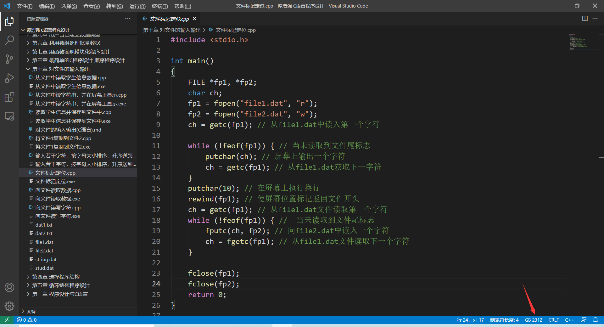
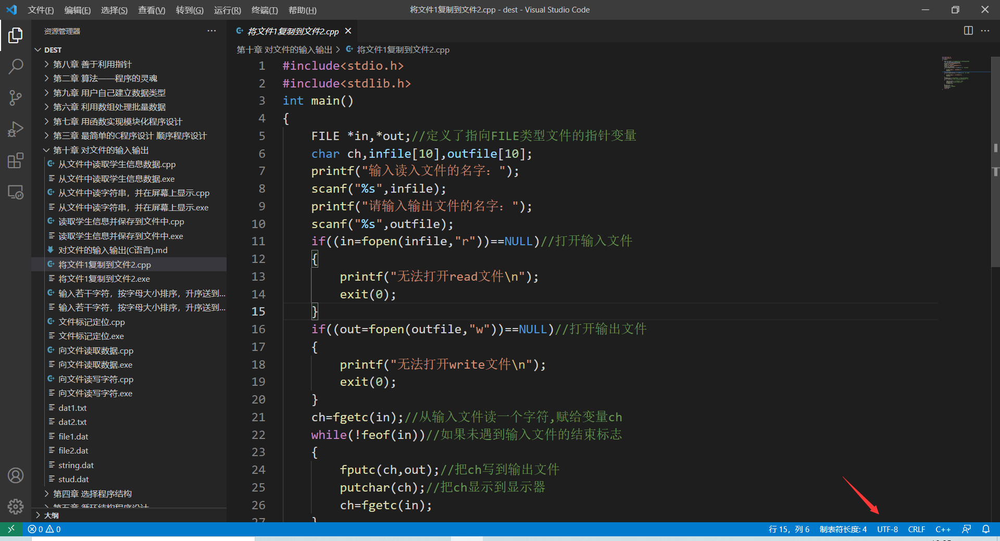

**编译器**： JDK14.0

**IDE**: Eclipse

**原理**： 调用了Java自带的库函数，Java支持的编码都可以。

**步骤**：

1. 使用Eclipse新建一个项目
2. 将该仓库的src文件都导入到你新建的项目中
3. 在文件管理器中建立你要的目标位置
4. 修改Main.java中的相关参数。
5. 编译并运行

**Tips**: 

这里提供了一个例子， 过滤出以.cpp为后缀的文件，它们原本是以 **GB2312**进行编码，现转化为以**UTF-8**进行编码。未被过滤的文件原样复制，并且保持文件的相对路径不变。如果是空文件夹，就不进行任何操作。

**图片**：

